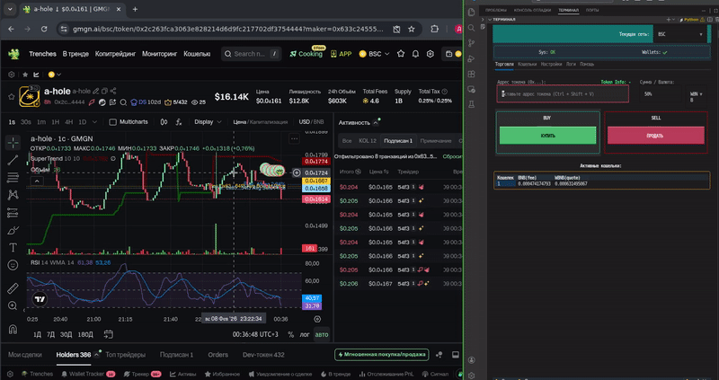

# EVM_TERMINAL 🚀



---

**EVM_TERMINAL** — это высокопроизводительный торговый терминал с текстовым интерфейсом (TUI), спроектированный для высокочастотной ручной торговли в EVM-совместимых сетях. Разработан для использования в тандеме с аналитическими платформами (например, [gmgn.ai](https://gmgn.ai)) для поиска токенов, тогда как сам терминал берет на себя агрегацию ликвидности и мгновенное исполнение ордеров в пулах V2/V3 сети **Binance Smart Chain (BSC)**.

Архитектурно проект представляет собой гибридную систему:
*   **Frontend & Business Logic:** Реализованы на **Python 3.12** с использованием фреймворка **Textual** для рендеринга TUI.
*   **Core Engine:** Критические для производительности компоненты (криптография, подписание транзакций, управление состоянием `Nonce`/`GasPrice`, работа с пулом RPC) вынесены в нативный модуль **Rust** (`dexbot_core`), взаимодействующий с Python через PyO3.

> **Note:**
> Репозиторий опубликован как демонстрация методов минимизации «логических» задержек на стороне клиента (State Prefetching, RPC Multiplexing). При соблюдении условий, описанных в разделе **Инфраструктура**, терминал полностью функционален. Обратите внимание: в коде присутствуют некоторые архитектурные упрощения и legacy-паттерны, обусловленные быстрой разработкой "в одни руки". 
---

## 📜 Коммерческое прошлое (Legacy Context)

Изначально **EVM_TERMINAL** разрабатывался в рамках заказа на фриланс-бирже и со временем начал эволюцию в сторону масштабируемого **коммерческого B2C продукта**, для русскоязычного крипто-комьюнити.

*   **Бизнес-модель:** Монетизация осуществлялась (и осуществляется на уровне смарт-контракта) за счет фиксированной комиссии **0.1%** с каждой транзакции пользователей терминала, проходящей через кастомный `TaxRouter`.
*   **Централизованная инфраструктура (удалена):** В оригинальной версии присутствовала жесткая привязка к бэкенду:
    *   Сбор детальной **телеметрии** и торговой статистики (данный функционал работал исключительно для пользователей, скачавших терминал по **реферальной ссылке**, что позволяло системе прозрачно рассчитывать партнерские вознаграждения).
    *   Система **OTA-обновлений** (Over-The-Air) бинарных файлов.
    *   Лицензирование с привязкой к аппаратному обеспечению (**HWID Binding**).

**Текущий статус:** В данной Open Source версии **вся централизованная логика, отвечающая за контроль и менеджмент пользователей, полностью вырезана**. Код очищен от любых запросов к управляющим серверам. Терминал работает абсолютно автономно, взаимодействуя исключительно с блокчейн-нодами. Смарт-контракт роутера остается неизменным.

---

## 🚀 Проблематика и архитектурные решения

Классический стек Web3 (web3.py / ethers.js) использует последовательную модель выполнения транзакции:
1. `eth_gasPrice` (сетевой запрос).
2. `eth_getTransactionCount` (сетевой запрос для получения Nonce).
3. Локальное подписание.
4. `eth_sendRawTransaction` (сетевой запрос).

В условиях скальпинга такая цепочка создает недопустимую задержку (RTT * 3). **Архитектура терминала исключает синхронные проверки в момент отправки ордера.**

### Реализованные решения:

1.  **State Prefetching (Rust Workers):**
    Вместо запроса данных "по требованию", Rust-ядро запускает фоновые воркеры, которые непрерывно актуализируют локальный стейт (`CORE_STATE`):
    *   `Nonce Monitor`: следит за счетчиком транзакций кошелька.
    *   `Gas Monitor`: обновляет цену газа через WSS или HTTP-поллинг.
    В момент нажатия «КУПИТЬ», транзакция собирается и подписывается за микросекунды, используя данные из RAM, без единого предварительного сетевого запроса.

2.  **RPC Multiplexing (Smart Pool):**
    Система не зависит от одной RPC-ноды. Реализован `RPC Pool Manager` на стороне Rust: система мониторит задержки до публичных и приватных эндпоинтов, автоматически маршрутизируя `sendRawTransaction` через "здоровую" ноду с минимальной латентностью.

### Результат:
Время от нажатия клавиши до индексации транзакции в мемпуле/эксплорере составляет **0.3–0.7 секунды** (при наличии качественного канала связи).
> **Note:**
> Так как вся бизнес логика находится и работает на устройстве пользователя. Важно дожидаться подтверждения транзакций перед отправкой следующей (оповещение об "успешности покупки/продажи", отображается в интерфейсе) иначе могут быть ошибки (reverted).


### Обратная сторона (Race Conditions):
Асинхронная работа с `Nonce` создает риск **гонок состояний** (ошибки `nonce too low` или `replacement transaction underpriced`), если параллельно прошла другая транзакция (например, автоматическая докупка газа или Approve).
*Решение:* В `dexbot_core` и Python-слое реализована логика **автоматического ретрая** и принудительной ресинхронизации (`force_resync_nonce`) при получении ошибок от RPC.

---

## ⚙️ Механика исполнения и TaxRouter

Для оптимизации маршрутизации и унификации работы с протоколами PancakeSwap V2 и V3 терминал использует собственный смарт-контракт — **TaxRouter**.

*   **Адрес контракта (BSC Mainnet):** [`0xcdcc4feee010fcd5301fd823085e3d3e7d414a46`](https://bscscan.com/address/0xcdcc4feee010fcd5301fd823085e3d3e7d414a46)
*   **Функционал:** Агрегация интерфейсов V2/V3 и автоматическое распределение комиссий.

### Комиссионная модель
В байт-код контракта зашита неизменяемая комиссия **0.1% (10 BPS)**. Логика списания оптимизирована для упрощения учета PnL — комиссия всегда берется в **Quote-токене** (WBNB, USDT):

1.  **Покупка (Buy):** Комиссия 0.1% вычитается из входного количества стейблов/BNB *до* свопа. В пул уходит "чистая" сумма.
2.  **Продажа (Sell):** Своп выполняется на полный объем токенов, комиссия 0.1% удерживается из полученного Quote-токена *после* свопа.
3.  **Безопасность:** Проверка проскальзывания (`amountOutMin`) выполняется после вычета комиссии, что предотвращает реверты из-за недостатка выходной суммы.

### Преимущества TaxRouter:
*   **Gas Efficiency:** Использование упрощенного роутера часто дешевле стандартного `UniversalRouter` за счет меньшего оверхеда в EVM.
*   **V2/V3 Hybrid:** Поддержка `swapExactTokensForTokens` (V2) и `exactInputSingle` (V3) в одном интерфейсе.
*   **Fee-On-Transfer Support:** Реализована поддержка токенов с налогом (burn/tax) через методы `SupportingFeeOnTransferTokens`.

---

## 📌 Основные возможности

- **Hybrid Stack (Python + Rust):** Python управляет UI и бизнес-логикой высокого уровня. Rust через FFI (PyO3) обеспечивает безопасность памяти, криптографию и сетевой I/O.
- **WebSocket (WSS) Event Listener:** Прямой перехват логов `Transfer` из блокчейна позволяет обновлять балансы в UI быстрее, чем при поллинге RPC.
- **Auto-Fuel System:** Фоновый процесс мониторит нативный баланс (BNB). При падении ниже порога происходит автоматический своп стейблкоинов на газ.
- **Real-time PnL Tracking:** `dexbot_core` рассчитывает чистую прибыль (Net PnL), учитывая цену входа, текущую ликвидность пула и комиссии.

---

## ⚠️ Инфраструктура

1.  **Геолокация и Пинг:** Для реализации преимуществ архитектуры критически важна физическая близость к нодам. Рекомендуется деплой на **VPS (Франкфурт/Лондон)**. Работа через SSH добавит визуальный лаг, но исполнение транзакций останется быстрым.
2.  **Качество сети:** Использование Wi-Fi или 4G недопустимо из-за джиттера. Требуется стабильное проводное соединение (от 50 Мбит/с).

---

## [Windows] Важное примечание

**Для корректного рендеринга TUI:**
1. Используйте **[Windows Terminal](https://apps.microsoft.com/store/detail/windows-terminal/9N0DX20HK701)**.
2. Установите его как **«Терминал по умолчанию»** в настройках Windows.
3. Запуск в `cmd.exe` или PowerShell (legacy) приведет к поломке верстки и неработоспособности хоткеев (например, Ctrl+Shift+V).

---

## 🔐 Безопасность и криптография

- **Storage Encryption:** Приватные ключи хранятся в локальной SQLite БД, зашифрованной по стандарту **AES-256-GCM**.
- **Key Derivation:** Мастер-пароль преобразуется в ключ шифрования с использованием **PBKDF2-HMAC-SHA256** (соль 16 байт, 480,000 итераций).
- **Rust Isolation:** Операции с приватными ключами (расшифровка, подпись через `secp256k1`) выполняются внутри памяти Rust-модуля. Ключи в открытом виде минимальное время находятся в Python-слое.
- **Автономность:** Отсутствуют бэкдоры или механизмы удаленного управления.

---

## ⌨️ Управление (Горячие клавиши)

| Клавиша | Действие |
| :--- | :--- |
| **T / Е** | Переход: Вкладка **Торговля** (Trade) |
| **W / Ц** | Переход: Вкладка **Кошельки** (Wallets) |
| **S / Ы** | Переход: Вкладка **Настройки** (Settings) |
| **L / Д** | Переход: **Логи** (Logs) |
| **↑ / ↓** | Смена режима: **BUY / SELL** |
| **Enter** | **Исполнить ордер** (Execute Trade) |
| **Delete** | Очистка поля адреса токена |
| **Ctrl + R** | **Force Resync** (Сброс кэша nonce и балансов) |
| **Shift + ↑/↓** | Проскальзывание (Slippage) +/- 0.5% |
| **Shift + ←/→** | Цена газа (Gas Price) +/- 0.1 Gwei |

---

## 🛠 Инструкция по сборке

### Особенности build.py (Legacy Protection)
Скрипт `build.py` содержит механизмы **обфускации** (компиляция в байт-код, упаковка через `marshal`, `base64`, использование `Cython`). Это — технический атавизм коммерческой версии, служивший защитой от реверс-инжиниринга. В текущей версии он сохранен для демонстрации подхода к сборке self-contained приложений на Python.

### Сборка из исходников
**Требования:**
- **Python 3.12+**
- **Rust Toolchain** (latest stable) + `maturin`
- **Linux:** `sudo apt install build-essential python3-dev libssl-dev pkg-config`
- **Windows:** Visual Studio Build Tools 2022 (C++ workload).

**Пошаговый процесс:**

1. **Клонирование:**
   ```bash
   git clone https://github.com/JustAMamont/evm_terminal
   cd evm_terminal
   ```

2. **Окружение:**
   ```bash
   python3.12 -m venv env
   source env/bin/activate  # или env\Scripts\activate для Windows
   ```

3. **Зависимости Python:**
   ```bash
   pip install -r requirements.txt
   ```

4. **Компиляция Rust-ядра (`dexbot_core`):**
   ```bash
   cd rust_module
   maturin develop --release
   cd ..
   ```

5. **Сборка бинарника (опционально):**
   ```bash
   python build.py
   # Артефакт появится в корне проекта
   ```

6. **Запуск (Dev Mode):**
   ```bash
   python main.py
   ```

---

## ⛔ Disclaimer
Программное обеспечение предоставляется на условиях «как есть» (AS IS). Автор не несет ответственности за любые финансовые убытки, возникшие в результате использования терминала, ошибок кода, сбоев RPC-нод или блокчейн-сети. Торговля криптовалютами сопряжена с высоким риском. Используя данный софт, вы соглашаетесь с тем, что с каждой успешной транзакции через `TaxRouter` удерживается комиссия 0.1%.

---

## 💬 Контакты
**Telegram:** [@optional_username_37](https://t.me/optional_username_37)