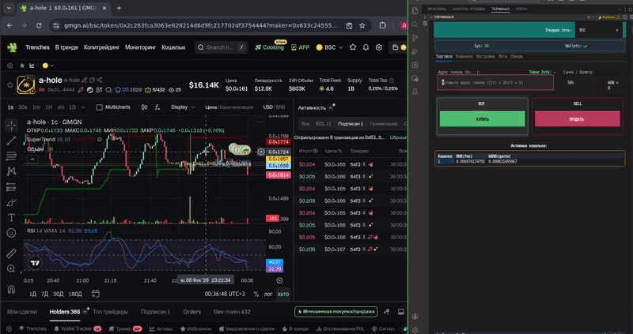

# EVM_TERMINAL 🚀



Высокоскоростной торговый терминал (TUI) для DEX. Гибрид Python + Rust.

> **Важно:** Бот архитектурно поддерживает любые EVM-совместимые сети. На данный момент реализована и протестирована только **BSC (Binance Smart Chain)**. Добавление новых сетей — см. [networks/README.md](networks/README.md).

---

## Содержание

- [Архитектура](#архитектура)
- [Требования](#требования)
- [Сборка](#сборка)
- [Использование](#использование)
- [Горячие клавиши](#горячие-клавиши)
- [TaxRouter](#taxrouter)
- [Безопасность](#безопасность)
- [Legacy Context](#legacy-context)

---

## Архитектура

```
+----------------------- PYTHON LAYER ------------------------+
|                                                             |
|  +------------+     +--------------+     +---------------+  |
|  | TUI        |     | GlobalCache  |     | BridgeManager |  |
|  | (Textual)  |---->| - Balances   |---->| - Commands    |  |
|  | - Render   |     | - Positions  |     | - Events      |  |
|  | - Input    |     | - PnL        |     |               |  |
|  +------------+     +--------------+     +---------------+  |
|                                                             |
+---------------------------|---------------------------------+
                            | PyO3 FFI
+---------------------------|---------------------------------+
|                     RUST CORE (dexbot_core)                 |
|                                                             |
|  EVENT LOOP                                                 |
|  +-- Nonce Monitor (prefetch)    --> 0ms execution          |
|  +-- GasPrice Monitor (prefetch) --> 0ms execution          |
|  +-- WebSocket Client                                       |
|      +-- Pool Updates                                       |
|      +-- Balance Updates                                    |
|                                                             |
|  RPC POOL                                                   |
|  +-- [Node1] [Node2] [Node3] --> Smart routing by latency   |
|                                                             |
|  EXECUTION ENGINE                                           |
|  +-- Transaction signing (secp256k1)                        |
|  +-- Nonce management                                       |
|  +-- Auto-approve for sell                                  |
|  +-- Event deduplication                                    |
|                                                             |
+---------------------------|---------------------------------+
                            v
                     EVM Network
                     RPC / WSS
```

### Поток данных

```
User presses "BUY"
        |
        v
TUI: action_execute
  +-- Validation
  +-- Collect data
        |
        | EngineCommand.ExecuteTrade
        v
BridgeManager.send()
  +-- JSON serialization
  +-- Crossbeam channel
        |
        v
RUST: Execution Engine
  +-- 1. Get nonce from CORE_STATE (RAM)    <-- prefetch, 0ms
  +-- 2. Get gas_price from CORE_STATE      <-- prefetch, 0ms
  +-- 3. Sign tx (secp256k1)                <-- ~50us
  +-- 4. Select fastest RPC node            <-- smart pool
  +-- 5. sendRawTransaction
        |
        v
EVM Mempool (Latency: 0.3-0.7s)
        |
        v
RUST: Event -> Python
  +-- TxSent
  +-- TxConfirmed
  +-- BalanceUpdate
        |
        v
TUI: UI Update
  +-- Transaction status
  +-- Balance
  +-- PnL
```

---

## Требования

### Зависимости
- Python 3.12+
- Rust (stable) + maturin
- Linux: `build-essential python3-dev libssl-dev`
- Windows: VS Build Tools 2022 (C++ workload)

### Сеть
- VPS во Франкфурте/Лондоне (пинг к BSC nodes)
- Интернет-канал в 50+ Мбит/с

### Windows
- **Обязательно:** [Windows Terminal](https://apps.microsoft.com/store/detail/windows-terminal/9N0DX20HK701)
- Установить как терминал по умолчанию
- `cmd.exe` и PowerShell (legacy) сломают рендеринг и хоткеи

---

## Сборка

```bash
git clone https://github.com/JustAMamont/evm_terminal
cd evm_terminal

python3.12 -m venv env
source env/bin/activate  # Windows: env\Scripts\activate

pip install -r requirements.txt

cd rust_module
maturin develop --release
cd ..

python main.py
```

---

## Использование

### Первичная настройка

1. **Мастер-пароль** — при первом запуске создайте пароль для шифрования ключей
2. **Кошельки** — добавьте приватные ключи в вкладке Wallets
3. **RPC** — для BSC Mainnet публичные RPC работают из коробки
4. **Quote-валюта** — выберите WBNB/USDT/USDC в Settings

### Testnet (BSC Testnet)

⚠️ **Важно:** BSC Testnet требует приватный RPC!

Публичные RPC BSC Testnet не поддерживают WebSocket. Перед работой:
1. Получите приватный endpoint (Chainstack, QuickNode, Alchemy)
2. Вставьте HTTP endpoint в **Settings → RPC URL**
3. Приложение перезапустится

### Торговля

**Покупка (BUY):**
1. Вставьте адрес токена (`Ctrl+Shift+V`)
2. Введите сумму или процент (например `0.1` или `50%`)
3. Нажмите **КУПИТЬ** или `Enter`

**Продажа (SELL):**
1. Выберите токен (вставьте адрес)
2. Нажмите `↓` для переключения в режим SELL
3. Нажмите **ПРОДАТЬ** — продаётся 100% баланса токена

---

## Горячие клавиши

### Навигация

| Клавиша | Действие |
|---------|----------|
| `T` | Вкладка Торговля |
| `W` | Вкладка Кошельки |
| `S` | Вкладка Настройки |
| `L` | Вкладка Логи |
| `F` | Помощь |
| `Ctrl+Q` | Выход |

### Торговля

| Клавиша | Действие |
|---------|----------|
| `↑` / `↓` | Смена режима BUY / SELL |
| `Enter` | Выполнить операцию |
| `Ctrl+R` | Обновить данные |

### Вставка текста

| Клавиша | Действие |
|---------|----------|
| `Ctrl+Shift+V` | Вставить из буфера обмена |
| `Ctrl+V` | **Не работает** в TUI |

> ⚠️ **Важно:** Обычный `Ctrl+V` в терминальных приложениях не работает. Всегда используйте `Ctrl+Shift+V` для вставки адресов, ключей и других данных.

---

## TaxRouter

Смарт-контракт для маршрутизации V2/V3 с комиссией.

**Адрес (BSC Mainnet):** `0xcdcc4feee010fcd5301fd823085e3d3e7d414a46`

| Операция | Комиссия |
|----------|----------|
| Buy | 0.1% вычитается из входящей суммы |
| Sell | 0.1% вычитается из полученной суммы |

📖 **Инструкция по деплою и настройке:** см. [contract/README.md](contract/README.md)

---

## Безопасность

- AES-256-GCM шифрование приватных ключей
- PBKDF2-HMAC-SHA256 (480K итераций)
- Rust isolation для криптографии
- Нет бэкендов — работает автономно

---

## Legacy Context

Изначально **EVM_TERMINAL** разрабатывался как коммерческий B2C продукт для русскоязычного крипто-комьюнити.

**Бизнес-модель:** Монетизация через фиксированную комиссию **0.1%** с каждой транзакции, проходящей через кастомный `TaxRouter`.

**Централизованная инфраструктура (удалена):**
- Сбор телеметрии и торговой статистики
- Система OTA-обновлений бинарных файлов
- Лицензирование с привязкой к HWID

**Почему проект закрылся:** Из-за архитектурных ограничений клиентского приложения — нестабильная работа на домашних устройствах пользователей (высокий пинг, нестабильный интернет). Для достижения детерминированного поведения логики терминала по идее требуются приватные MEV-роутеры (bloXroute, Flashbots) или собственная нода — недоступные большинству ритейл-трейдеров ресурсы.

**Текущий статус:** Вся централизованная логика **полностью вырезана**. Код очищен от запросов к управляющим серверам. Терминал работает автономно. При хорошем пинге до нод (VPS в регионе дата-центров) программа демонстрирует стабильную и надёжную работу.

**Почему build.py такой замысловатый:** Скрипт содержит механизмы обфускации (компиляция в байт-код, `marshal`, `base64`, Cython) — технический атавизм коммерческой версии для защиты от реверс-инжиниринга. Сохранён как демонстрация подхода к сборке self-contained приложений.

---

## 📁 Документация

| Раздел | Файл |
|--------|------|
| Конфигурация сетей | [networks/README.md](networks/README.md) |
| Деплой контрактов | [contract/README.md](contract/README.md) |

---

## Disclaimer

AS IS. Автор не несёт ответственности за финансовые потери. Комиссия 0.1% за каждую транзакцию через TaxRouter — неотъемлемая часть логики бота. Можете свободно разворачивать/редактировать контракт под свои нужды.

---

**Telegram:** [@optional_username_37](https://t.me/optional_username_37)
